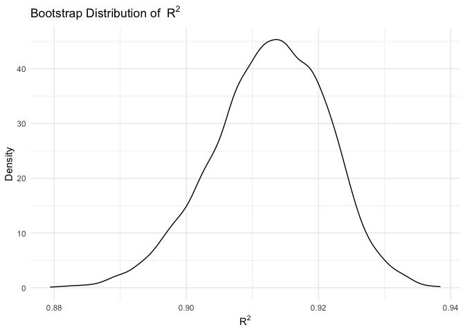
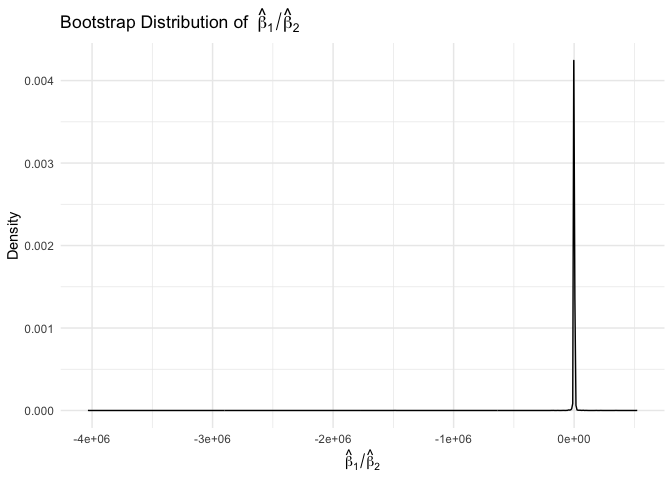

p8105_hw6_hz3023
================
Huiyi Zhu
2025-12-04

## Prepare

``` r
library(tidyverse)
```

    ## ── Attaching core tidyverse packages ──────────────────────── tidyverse 2.0.0 ──
    ## ✔ dplyr     1.1.4     ✔ readr     2.1.5
    ## ✔ forcats   1.0.1     ✔ stringr   1.5.2
    ## ✔ ggplot2   4.0.0     ✔ tibble    3.3.0
    ## ✔ lubridate 1.9.4     ✔ tidyr     1.3.1
    ## ✔ purrr     1.1.0     
    ## ── Conflicts ────────────────────────────────────────── tidyverse_conflicts() ──
    ## ✖ dplyr::filter() masks stats::filter()
    ## ✖ dplyr::lag()    masks stats::lag()
    ## ℹ Use the conflicted package (<http://conflicted.r-lib.org/>) to force all conflicts to become errors

``` r
library(broom)
library(modelr)
```

    ## 
    ## Attaching package: 'modelr'
    ## 
    ## The following object is masked from 'package:broom':
    ## 
    ##     bootstrap

``` r
library(ggplot2)
```

## Problem 1

``` r
homicide=read_csv("https://raw.githubusercontent.com/washingtonpost/data-homicides/master/homicide-data.csv") |> 
  mutate(
    city_state = str_c(city, ", ", state),
    victim_age = as.numeric(victim_age),
    solved = disposition == "Closed by arrest")|>
  filter(
    !city_state %in% c(
      "Dallas, TX",
      "Phoenix, AZ",
      "Kansas City, MO",
      "Tulsa, AL")) |>
  filter(victim_race %in% c("White", "Black"))
```

    ## Rows: 52179 Columns: 12
    ## ── Column specification ────────────────────────────────────────────────────────
    ## Delimiter: ","
    ## chr (9): uid, victim_last, victim_first, victim_race, victim_age, victim_sex...
    ## dbl (3): reported_date, lat, lon
    ## 
    ## ℹ Use `spec()` to retrieve the full column specification for this data.
    ## ℹ Specify the column types or set `show_col_types = FALSE` to quiet this message.

    ## Warning: There was 1 warning in `mutate()`.
    ## ℹ In argument: `victim_age = as.numeric(victim_age)`.
    ## Caused by warning:
    ## ! NAs introduced by coercion

``` r
baltimore=homicide|>
  filter(city_state == "Baltimore, MD")|>
  glm(
    solved ~ victim_age + victim_sex + victim_race,
    data = _,
    family = binomial())

baltimore_tidy= broom::tidy(baltimore, conf.int = TRUE) |> 
  mutate(
    OR = exp(estimate),
    OR_low = exp(conf.low),
    OR_high = exp(conf.high))

baltimore_tidy |>
  filter(term == "victim_sexMale") |>
  select(term, OR, OR_low, OR_high) |> 
  knitr::kable(digits=2)
```

| term           |   OR | OR_low | OR_high |
|:---------------|-----:|-------:|--------:|
| victim_sexMale | 0.43 |   0.32 |    0.56 |

``` r
city_OR <- homicide |>
  nest(data = -city_state) |>
  mutate(
    model = map(data,\(df) 
                glm(solved ~ victim_age + victim_sex + victim_race,
        data   = df,
        family = binomial())),
    tidy= map(model,\(mod) broom::tidy(mod, conf.int = TRUE) |>
        mutate(
          OR=exp(estimate),
          OR_low  = exp(conf.low),
          OR_high = exp(conf.high))))|>
  select(city_state, tidy) |>
  unnest(tidy) |>
  filter(term == "victim_sexMale") |>
  select(city_state, OR, OR_low, OR_high)
```

    ## Warning: There were 43 warnings in `mutate()`.
    ## The first warning was:
    ## ℹ In argument: `tidy = map(...)`.
    ## Caused by warning:
    ## ! glm.fit: fitted probabilities numerically 0 or 1 occurred
    ## ℹ Run `dplyr::last_dplyr_warnings()` to see the 42 remaining warnings.

``` r
city_OR
```

    ## # A tibble: 47 × 4
    ##    city_state         OR OR_low OR_high
    ##    <chr>           <dbl>  <dbl>   <dbl>
    ##  1 Albuquerque, NM 1.77   0.825   3.76 
    ##  2 Atlanta, GA     1.00   0.680   1.46 
    ##  3 Baltimore, MD   0.426  0.324   0.558
    ##  4 Baton Rouge, LA 0.381  0.204   0.684
    ##  5 Birmingham, AL  0.870  0.571   1.31 
    ##  6 Boston, MA      0.674  0.353   1.28 
    ##  7 Buffalo, NY     0.521  0.288   0.936
    ##  8 Charlotte, NC   0.884  0.551   1.39 
    ##  9 Chicago, IL     0.410  0.336   0.501
    ## 10 Cincinnati, OH  0.400  0.231   0.667
    ## # ℹ 37 more rows

``` r
city_OR |>
  mutate(city_state = fct_reorder(city_state, OR)) |>
  ggplot(aes(x = OR, y = city_state)) +
  geom_point() +
  geom_errorbarh(aes(xmin = OR_low, xmax = OR_high)) +
  geom_vline(xintercept = 1, linetype = "dashed") +
  labs(
    x = "Adjusted odds ratio (male vs female victims)",
    y = "City",
    title = "Adjusted ORs for solving homicides across cities")
```

    ## Warning: `geom_errobarh()` was deprecated in ggplot2 4.0.0.
    ## ℹ Please use the `orientation` argument of `geom_errorbar()` instead.
    ## This warning is displayed once every 8 hours.
    ## Call `lifecycle::last_lifecycle_warnings()` to see where this warning was
    ## generated.

<!-- -->

Most estimated odds ratios are below 1, suggesting that homicides of
male victims are generally less likely to be solved than those of female
victims. However, many confidence intervals cross 1, indicating
considerable uncertainty and limited evidence of a consistent or
statistically robust sex difference across cities.

## Problem 2

``` r
library(p8105.datasets)
data("weather_df")
set.seed(20)
centralpark = weather_df |>
  filter(name == "CentralPark_NY") |> 
  drop_na(tmax,tmin,prcp) |> 
  modelr::bootstrap(n=5000) |> 
  mutate(
    fit=map(strap, ~lm (tmax~tmin+prcp,data=.x)),
    r2=map_dbl(fit, ~broom::glance (.x)$r.squared),
    beta_ratio=map_dbl(fit, ~ {
      coefs <-broom::tidy (.x)
      beta1 <-coefs |> filter(term=="tmin") |> pull(estimate)
      beta2 <-coefs |> filter(term=="prcp") |> pull(estimate)
      beta1/beta2
    })
  ) |> 
  select (-strap,-fit)
centralpark
```

    ## # A tibble: 5,000 × 3
    ##    .id      r2 beta_ratio
    ##    <chr> <dbl>      <dbl>
    ##  1 0001  0.917      -560.
    ##  2 0002  0.919      -773.
    ##  3 0003  0.917      -384.
    ##  4 0004  0.924      -293.
    ##  5 0005  0.914     -1058.
    ##  6 0006  0.903     -1960.
    ##  7 0007  0.908      -635.
    ##  8 0008  0.923      -923.
    ##  9 0009  0.909       650.
    ## 10 0010  0.909     -5115.
    ## # ℹ 4,990 more rows

``` r
centralpark |>
  ggplot(aes(x = r2)) +
  geom_density() +
  labs(
    title = expression("Bootstrap Distribution of " ~ R^2),
    x = expression(R^2),
    y = "Density"
  ) +
  theme_minimal()
```

<!-- -->

The bootstrap distribution of $R^2$ is unimodal and tightly
concentrated, with most estimates between 0.879 and 0.938. The peak
around 0.913.

``` r
centralpark |>
  ggplot(aes(x = beta_ratio)) +
  geom_density() +
  labs(
    title = expression("Bootstrap Distribution of " ~ hat(beta)[1] / hat(beta)[2]),
    x = expression(hat(beta)[1] / hat(beta)[2]),
    y = "Density"
  ) +
  theme_minimal()
```

<!-- -->

The bootstrap distribution of $\hat\beta_1 / \hat\beta_2$ is extremely
unstable. Because $\hat\beta_2$ is very close to zero in many bootstrap
samples, the ratio becomes very large in magnitude, producing a
distribution with long tails and a sharp spike near zero. This indicates
that the ratio $\hat\beta_1 / \hat\beta_2$ is not a reliable quantity
for inference in this model.

``` r
centralpark |>
  summarize(
    r2_low   = quantile(r2, 0.025),
    r2_high  = quantile(r2, 0.975),
    ratio_low  = quantile(beta_ratio, 0.025),
    ratio_high = quantile(beta_ratio, 0.975)
  )
```

    ## # A tibble: 1 × 4
    ##   r2_low r2_high ratio_low ratio_high
    ##    <dbl>   <dbl>     <dbl>      <dbl>
    ## 1  0.894   0.928    -5320.      4265.

## Problem 3
